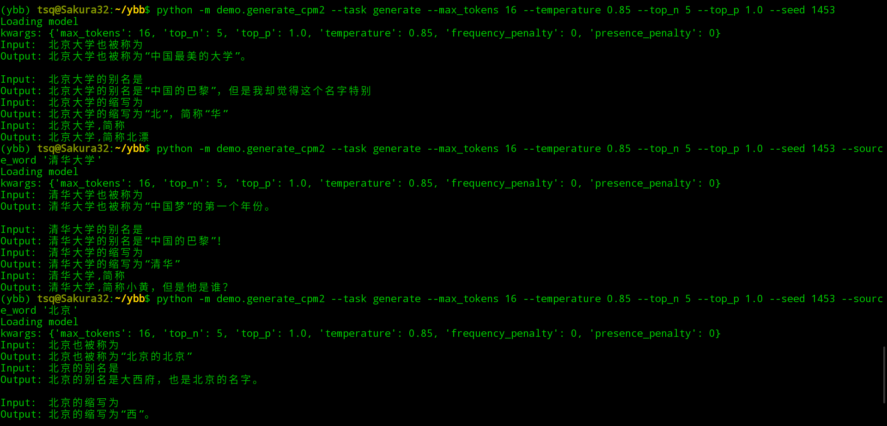
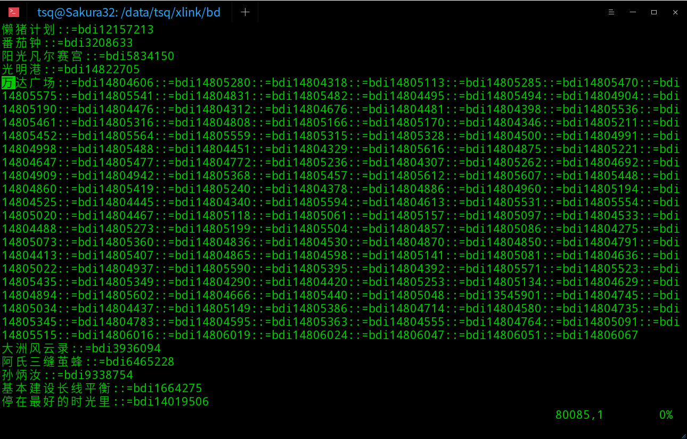
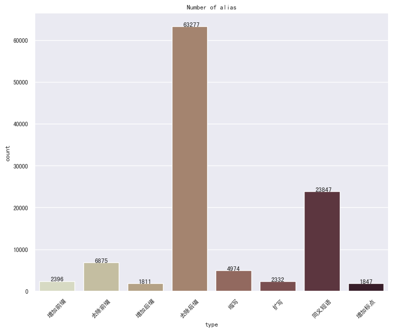
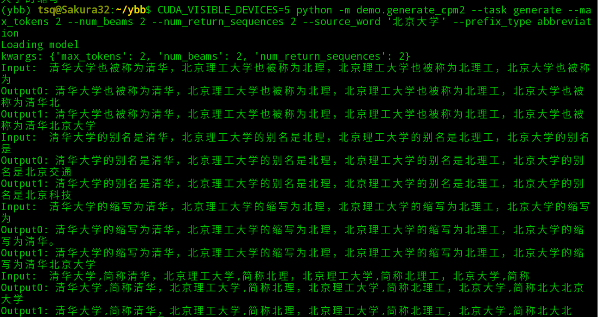
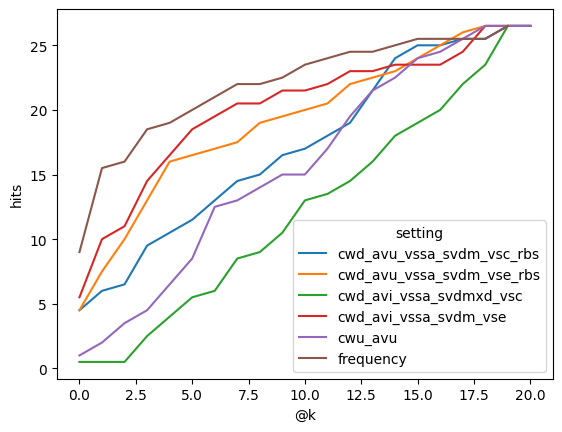
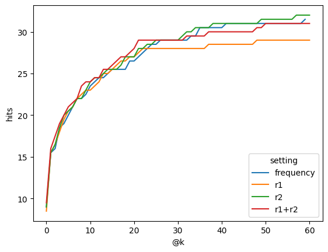

README

This is the repository for our unsupervised alias generation task.

We utilize pretrained language model(e.g. GPT2) to generate possible mentions for a word.

Here are the packages:

- demo
  - You can try out some examples here.
- src


# 1. Interesting Result

## 1.1 Reproduction

Using the **same parameters** may get **different outputs:**(2021/10/29) 


I think this is caused by our decoding strategy which is sampling. If we set the random seed, it will generate the same output:(2021/11/2) 


## 1.2 Try different patterns

Here is the result of different patterns:



## 1.3 Beam search with CPM2

Here is the result for `num_beams = 2`:


For `num_beams = 8`:


Well, maybe some results are relevant. But it is strange that :

- Some template can not generate enough beams.
- When `num_beams` get larger, the results get worse.


# 2. Dataset

## 2.1 Reverse `xlink` table

We reverse the entity linking relations and get the map between  the entity id and mentions (See `README` under `src`).

Here are some types which frequently appear in the result:

| Type          | example                             |
| ------------- | ----------------------------------- |
| Prefix_extend | 夏宫::=彼得大帝夏宫                 |
| Prefix_reduce | 晋祠水母楼::=水母楼                 |
| Suffix_extend | 永夜城::=永夜城（短篇小说）         |
| Suffix_reduce | 雍公馆（若水店）::=雍公馆           |
| Abbreviation  | 国家国防动员委员会::=国动委         |
| Expansion     | 济南十九中学::=山东省济南第十九中学 |
| Synonym       | 波尔多红酒::=波尔多葡萄酒           |
| Punctuation   | 洛奇::=《洛奇》                     |

## 2.2 Definition of `hasAlias`

We know that a mention may be correspond to different entities, like `万达广场`, we call them `surjective alias`, the mention which has only one corresponding entity is called `injective alias`, like `番茄钟`: 



Let $e$ denote the entity, $w$ denote the word, $W_e$ denote the set of $e$'s injective alias.

If $w$ only  corresponds to one entity $e$ ,  then for any word $w_i \in W_e$,   $w$  `hasAlias` $w_i$ and $w_i$  `hasAlias` $w$.  Also,  $w \in W_e$ 

If  $w$  corresponds to a set of entities $E_w$,   then for the entity $e_i \in E_w$ , $e_i$ has a set of injective alias $W_{e_i}$, for all the injective alias $w_{j} \in W_{e_i}$,  $w_i$  `hasAlias` $w$.  

Here is the distribution of different alias types:



# 3. Ways of few shot prompt

## 3.1 task-specific prefix

without task-specific prefix prompt:


with task-specific prefix prompt:



with wrong task prefix prompt (Transfer from synonym to abbreviation):


### 3.1.1 Evaluation result

**Randomly** sample  alias words and use 4 template` ['也被称为', '的别名是', '的缩写为', ',简称']` to generate 4 prompt prefix and each prefix will be feed into `cpm2` to get a predict target word.  

| alias_type   | max_tokens | decode | EM 4@1  | True_contain 4@1 |
| ------------ | ---------- | ------ | ------- | ---------------- |
| prefix       | 2          | sample | 0.06495 | 0.6922           |
| suffix       | 4          | sample | 0.43980 | 2.7388           |
| abbreviation | 2          | sample | 0.02621 | 0.1890           |
| abbreviation | 2          | beam=2 | 0.00414 | 0.0648           |
| synonym      | 2          | beam=2 | 0.00240 | 0.0429           |
| synonym      | 4          | sample | 0.00996 | 0.1329           |
| punctuation  | 4          | sample | 1.65393 | 1.6539           |

change `task_specific_prompt_num` and `task_definition`

`task_definition` is the prefix like: `接下来进行别名生成，比如xx也叫yy`

| alias_type | task_specific_prompt_num | task_definition | EM 4@1  | True_contain 4@1 |
| ---------- | ------------------------ | --------------- | ------- | ---------------- |
| prefix     | 4                        | false           | 0.06495 | 0.6922           |
| prefix     | 2                        | false           | 0.05734 | 0.5840           |
| prefix     | 1                        | false           | 0.03043 | 0.2557           |
| prefix     | 2                        | true            | 0.05734 | 0.6080           |
| prefix     | 4                        | true            | 0.05383 | 0.6799           |
| prefix     | 8                        | true            | 0.05208 | 0.7297           |
| synonym    | 8                        | true            | 0.03100 | 0.3990           |
| synonym    | 8                        | false           | 0.04300 | 0.3890           |

In the past, one template only generate one word.

Now we will generate more result for one template.

| alias_type | decode  | EM 6@10 | True_contain 6@10 |
| ---------- | ------- | ------- | ----------------- |
| prefix     | sample  | 0.22469 | 1.74956           |
| prefix     | beam=10 | 0       | 0.12814           |
| prefix     | beam=16 | 0       | 0.18432           |

@50

| alias_type   | decode | n    | EM 4@n | True_contain 4@n |
| ------------ | ------ | ---- | ------ | ---------------- |
| synonym      | sample | 10   | 0.145  | 0.21             |
| synonym      | sample | 50   | 0.27   | 0.35             |
| abbreviation | sample | 50   | 0.195  | 0.5              |

pattern number

| alias_type | decode | pattern_num | EM pn@10 | True_contain pn@10 |
| ---------- | ------ | ----------- | -------- | ------------------ |
| synonym    | sample | 4           | 0.145    | 0.21               |
| synonym    | sample | 6           | 0.24     | 0.345              |

Now, we find that the pattern number may help more, we will create more template and try again. Because the `EM pn@n `is not a good measurement due to its bias with right results' number. We will use `best_EM` (means that the results have at lease one Exact Match) which has a max value 1 with each input.

| alias_type | pattern_num | n    | top_n_range | max_tokens_scale | best_EM | best_True |
| ---------- | ----------- | ---- | ----------- | ---------------- | ------- | --------- |
| synonym    | 4           | 10   | None        | None             | 0.065   | 0.095     |
| synonym    | 4           | 50   | None        | None             | 0.09    | 0.115     |
| synonym    | 6           | 10   | None        | None             | 0.07    | 0.1       |
| synonym    | 6           | 20   | 2           | 2                | 0.085   | 0.255     |
| synonym    | 6           | 20   | 2           | 1.5              | 0.05    | 0.28      |
| synonym    | 6           | 20   | 1           | 1.5              | 0.04    | 0.26      |
| synonym    | 6           | 20   | 1           | 2                | 0.07    | 0.275     |
| synonym    | 6           | 50   | 2           | 2                | 0.11    | 0.33      |
| synonym    | 6           | 50   | 4           | 2                | 0.115   | 0.325     |

add redundancy & punctuation strategy

(default: top_n_range=2 max_tokens_scale=2 pattern_num=6)

| alias_type | n             | punctuation | best_EM | best_True |
| ---------- | ------------- | ----------- | ------- | --------- |
| synonym    | 20            | None        | 0.085   | 0.255     |
| synonym    | 40(return 20) | None        | 0.035   | 0.305     |
| synonym    | 20            | lazy        | 0.175   | 0.195     |
| synonym    | 20            | all         | 0.125   | 0.155     |

using `set` to remove redundancy and check the separated_char in the striped string:

(default: top_n_range=4 max_tokens_scale=2 pattern_num=6)

| alias_type | n                          | redundancy          | punctuation | best_EM | best_True |
| ---------- | -------------------------- | ------------------- | ----------- | ------- | --------- |
| synonym    | 20                         | None                | None        | 0.085   | 0.255     |
| synonym    | 40(return 20)              | None                | None        | 0.075   | 0.29      |
| synonym    | 40(return 20)              | None                | lazy        | 0.16    | 0.205     |
| synonym    | 20                         | None                | lazy        | 0.185   | 0.215     |
| synonym    | 20                         | None                | all         | 0.18    | 0.22      |
| synonym    | 20                         | max_overlap_scale=1 | lazy        | 0.195   | 0.255     |
| synonym    | 20(return all)<br/>avg: 27 | max_overlap_scale=1 | lazy        | 0.26    | 0.285     |
| synonym    | 20                         | max_overlap_scale=1 | all         | 0.195   | 0.23      |
| synonym    | 40(return 20)              | max_overlap_scale=2 | lazy        | 0.03    | 0.275     |
| synonym    | 40(return 20)              | max_overlap_scale=1 | lazy        | 0.16    | 0.26      |

Different alias type domain:

(default: top_n_range=4 max_tokens_scale=2 pattern_num=6 num_return_sequences all num_generate_sequences=50 max_overlap_scale=1 punctuation_strategy=lazy example_num=2000)

| alias_type   | pattern_num | avg_num_generate_sequences | best_EM | best_True |
| ------------ | ----------- | -------------------------- | ------- | --------- |
| synonym      | 6           | 62.49666666666667          | 0.31    | 0.33      |
| abbreviation | 4           | 74.1275                    | 0.26    | 0.325     |
| prefix       | 6           | 61.9475                    | 0.595   | 0.725     |
| suffix       | 4           | 63.8425                    | 0.855   | 0.875     |
| punctuation  | 5           | 50.876                     | 0.765   | 0.835     |

In fact, we can use `Iverson mark` to represent and calculate the number of generated words, for example:


$$
\sum\limits_{tn,mt,s} [1\le top\_n \le9][max\_tokens \in \{\frac{1}{2},1,2\}][0\le seed \le num\_gen/(9*3)]
$$

### 3.1.2 Case study

- The correlation between sampled alias_table and generated tgt_word is very high, for example:

  - ``` json
       {
            "iter": 60,
          		"src_word": "吴子兵法",
            "golden": "吴起兵法",
            "pred": [
                    "吴子兵",
                    "华农兄弟",
                    "吴子兵，华农兄弟",
                    "吴子兵",
                    "吴子兵的中国音乐",
                    "中国乐坛",
                    "中国",
                    "吴子兵，吴子兵的中国音乐，中国乐坛，中国",
                    "王宝合的同义",
                    "吴亦凡，王宝合的同义",
                    "吴亦凡的“吴子兵”",
                ],
            "alias_table": {
                "王宝合": [
                    "鬼手"
                ],
                "华语歌坛": [
                    "华语乐坛"
                ],
                "反坦克枪": [
                    "反坦克步枪"
                ],
                "光子": [
                    "光量子"
                ]
          		 }
          	}
    ```

    - Although "华语歌坛" -> ''华语乐坛'  provide an example of synonym, it is not in the same domain  with "吴子兵法". So it brings some strange semantic which puzzles the Language Model.

  - **Possible Solution**: Maybe we should find the example alias with **similar semantic** that our `src_word `has.

    - We may not randomly sample examples but provide a small example database with words from different domains. 
    - As for how to create the database, I think **k-means clustering** may be reasonable. We can use the word in the cluster center to represent the cluster.
    - We can calculate the semantic similarity between the input `src_word ` and the words in the database to find out the most similar examples. Then we use these examples as prompt.

- **Chinese Name Generation** is very hard, for example:  

  - ```json
     {
            "iter": 10,
            "src_word": "郑光祖",
            "golden": "郑德辉",
            "pred": [
                [
                    "郑光祖",
                    "王一郑光祖",
                    "郑光",
                    "郑光祖，王一郑光祖，郑光",
                    "郑光祖。这个郑光祖",
                    "郑光祖",
                    "这个郑光祖，郑光",
                    "郑光祖。这个郑光祖，郑光",
                    "郑光祖郑光祖",
                    "郑郑"
                ]
            ]
    }
    ```

    - In fact, we check the `Baidu Baike` and find that :

      - 郑光祖（1264年—？） ，字德辉，汉族，[平阳](https://baike.baidu.com/item/平阳/3819506)[襄陵](https://baike.baidu.com/item/襄陵/6852152)（今山西[临汾市](https://baike.baidu.com/item/临汾市/529505)[襄汾县](https://baike.baidu.com/item/襄汾县/490791)）人，元代著名[杂剧](https://baike.baidu.com/item/杂剧/827051)家、[散曲](https://baike.baidu.com/item/散曲/295113)家。

    - In Info box:

      - 中文名

        郑光祖

        别  名

        郑德辉

    - So, if we want to overcome the alias type like someone's `字`  . We should provide the prompt pattern like `src_name ，字 ` and the generated word should be concatenated  with the `src_name`'s last name.

## 3.2 alias data

use support set as alias_data_source & sample different tables for one src_word

(default: top_n_range=4 max_tokens_scale=2 pattern_num=4 num_return_sequences all num_generate_sequences=50 max_overlap_scale=1 punctuation_strategy=lazy example_num=2000)

alias_type==abbreviation:

| alias_data_source | alias_table_num | avg_num  | best_EM | best_True | EM                                                | True                                               |
| ----------------- | --------------- | -------- | ------- | --------- | ------------------------------------------------- | -------------------------------------------------- |
| support_pool=20   | 4               | 77.07875 | 0.275   | 0.33      | [ 0.185,        0.145,        0.185,        0.21] | [0.225,        0.225,        0.245,        0.27]   |
| support_pool=20   | 2               | 42.27625 | 0.23    | 0.28      | [ 0.13,        0.13,        0.165,        0.165]  | [0.185,        0.185,        0.215,        0.225]  |
| whole_dataset     | 4               | 87.03375 | 0.27    | 0.33      | [0.165,        0.2,        0.21,    0.22 ]        | [  0.225,        0.25,        0.26,        0.255 ] |
| whole_dataset     | 2               | 46.12    | 0.225   | 0.265     | [ 0.125,        0.125,        0.155,        0.17] | [0.195,        0.175,        0.185,        0.23]   |

change template for abbreviation and generate more:

| pattern           | seq_gen | table | example | avg_num  | best_EM | best_True | EM                                              | True                                             |
| ----------------- | ------- | ----- | ------- | -------- | ------- | --------- | ----------------------------------------------- | ------------------------------------------------ |
| 4                 | 50      | 4     | 4       | 77.07875 | 0.275   | 0.33      | [ 185,        0.145,        0.185,        0.21] | [0.225,        0.225,        0.245,        0.27] |
| ['，即', ',简称'] | 100     | 4     | 4       | 119.0075 | 0.25    | 0.29      | [0.215,        0.205]                           | [0.255,        0.255]                            |
| [,'简称']         | 150     | 4     | 4       | 160.66   | 0.245   | 0.295     | [0.245]                                         | [0.295]                                          |
| [',简称']         | 200     | 4     | 4       | 198.205  | 0.245   | 0.305     | [0.245]                                         | [0.305]                                          |

**Question**: we don't know whether `src_word`  or `tgt_word`  is shorter. So the template and example may provide opposite meaning.

Re-rank by frequency of `pred_word`:

| pattern   | seq_gen     | table | avg_num | best_EM | best_True | Status |
| --------- | ----------- | ----- | ------- | ------- | --------- | ------ |
| [,'简称'] | 150(re 500) | 4     | 160.66  | 0.245   | 0.295     | Right  |
| [',简称'] | 150(re 500) | 8     | 285.475 | 0.28    | 0.345     | Wrong  |
| [,'简称'] | 150(re 500) | 4     | 161.505 | 0.24    | 0.28      | Right  |
| [',简称'] | 150(re 500) | 8     | 285.63  | 0.255   | 0.305     | Wrong  |
| [',简称'] | 150(re 500) | 16    | 418.58  | 0.31    | 0.335     | Wrong  |
| [',简称'] | 200(re 500) | 16    | 448.1   | 0.345   | 0.405     | Wrong  |

We find that our result has a little difference between w/o re-rank maybe this is because the difference of sampled example alias tables (`row2` vs. `row4`). We didn't specify random seed for sampling alias table.

**From 2021/11/30 every alias table will have a corresponding seed.**

**Question**:  But how to make sure our fixed seed sampled table has no bias ???

(default: table=32, seq_gen= 256, re=500, pattern_num=1)

| pattern        | type         | avg_num | best_EM | best_True | Re_EM                                                        |
| -------------- | ------------ | ------- | ------- | --------- | ------------------------------------------------------------ |
| ['又名']       | prefix       | 344.875 | 0.67    | 0.78      | "hits@0": 19.5, <br/>"hits@1": 28.0,<br/>    "hits@2": 34.5,<br/>    "hits@3": 39.0,<br/>    "hits@4": 42.5,<br/>    "hits@5": 44.0, |
| [',简称']      | suffix       | 340.28  | 0.905   | 0.915     | "hits@0": 54.0,<br/>    "hits@1": 65.5,<br/>    "hits@2": 72.0,<br/>    "hits@3": 76.0,<br/>    "hits@4": 78.5,<br/>    "hits@5": 79.0, |
| [',简称']      | abbreviation | 311.115 | 0.285   | 0.325     | hits@0": 3.5,<br/>    "hits@1": 9.0,<br/>    "hits@2": 10.5,<br/>    "hits@3": 14.5,<br/>    "hits@4": 15.5,<br/>    "hits@5": 15.5, |
| ['的同义词是'] | synonym      | 240.36  | 0.3     | 0.35      | "hits@0": 5.5,<br/>    "hits@1": 11.0,<br/>    "hits@2": 12.0,<br/>    "hits@3": 12.5,<br/>    "hits@4": 14.0,<br/>    "hits@5": 15.0, |
| ['的别名是']   | punctuation  | 297.58  | 0.895   | 0.93      | "hits@0": 18.0,<br/>    "hits@1": 47.5,<br/>    "hits@2": 58.5,<br/>    "hits@3": 68.5,<br/>    "hits@4": 76.0,<br/>    "hits@5": 77.0, |

We find a bug and has repaired it, but the bad news is that our experiment result from 2021/11/26 to 2021/11/30 are partially wrong. For these experiments with error code: if the default table_num is 4, then nothing will be wrong.

## 3.3 reconstruct dataset

rerank by freq (has the line `text += value_string`):

| pattern        | type         | avg_num | best_EM | best_True | Re_EM                                                        |
| -------------- | ------------ | ------- | ------- | --------- | ------------------------------------------------------------ |
| ['的同义词是'] | synonym      | 298.015 | 0.23    | 0.255     | "hits@0": 3.0,  "hits@1": 4.0,    "hits@2": 4.0,    "hits@3": 6.0,    "hits@4": 7.5,    "hits@5": 8.5, |
| ['，简称']     | abbreviation | 449.115 | 0.715   | 0.745     | "hits@0": 17.5,    "hits@1": 28.0,    "hits@2": 33.0,    "hits@3": 35.5,    "hits@4": 38.0,   "hits@5": 40.0, |

rerank by freq (not has the line `text += value_string`):

| pattern        | type         | avg_num | best_EM | best_True | Re_EM                                                        |
| -------------- | ------------ | ------- | ------- | --------- | ------------------------------------------------------------ |
| ['，即']       | expansion    | 281.715 | 0.345   | 0.36      | "hits@0": 11.0,    "hits@1": 16.0,    "hits@2": 16.5,    "hits@3": 18.5,    "hits@4": 18.5,    "hits@5": 20.0, |
| ['，简称']     | abbreviation | 443.725 | 0.71    | 0.74      | "hits@0": 18.0,    "hits@1": 27.0,    "hits@2": 32.0,    "hits@3": 34.0,    "hits@4": 37.0,    "hits@5": 39.0, |
| ['的同义词是'] | synonym      | 281.135 | 0.215   | 0.26      | "hits@0": 2.5,    "hits@1": 3.5,    "hits@2": 4.0,    "hits@3": 5.0,    "hits@4": 6.5,    "hits@5": 7.5, |
| ['的别名是']   | punctuation  | 265.811 | 0.919   | 0.94      | "hits@0": 59.5,    "hits@1": 74.6,    "hits@2": 77.3,    "hits@3": 79.46,    "hits@4": 80.0,    "hits@5": 81.6, |

- The difference of having the line `text += value_string` or not is marginal.

different rerank strategies for abbreviation:

(cpm2_concat_value_string: concat)

| cal_prob | strategy    | avg_num | best_EM | best_True | Re_EM                                                        |
| -------- | ----------- | ------- | ------- | --------- | ------------------------------------------------------------ |
| softmax  | frequency   | 449.115 | 0.715   | 0.745     | "hits@0": 17.5,    "hits@1": 28.0,    "hits@2": 33.0,    "hits@3": 35.5,    "hits@4": 38.0,   "hits@5": 40.0, |
| softmax  | probability | 449.115 | 0.705   | 0.75      | "hits@0": 0.0,    "hits@1": 0.5,    "hits@2": 2.0,    "hits@3": 2.0,    "hits@4": 3.0,   "hits@5": 4.0, |
| softmax  | prob_freq   | 449.115 | 0.715   | 0.745     | "hits@0": 13.5,    "hits@1": 21.5,    "hits@2": 27.5,    "hits@3": 30.5,    "hits@4": 35.0,    "hits@5": 36.5, |

different rerank strategies for synonym:

(cpm2_concat_value_string: concat)

| cal_prob | strategy    | avg_num | best_EM | best_True | Re_EM                                                        |
| -------- | ----------- | ------- | ------- | --------- | ------------------------------------------------------------ |
| softmax  | frequency   | 298.015 | 0.23    | 0.255     | "hits@0": 3.0,  "hits@1": 4.0,    "hits@2": 4.0,    "hits@3": 6.0,    "hits@4": 7.5,    "hits@5": 8.5, |
| softmax  | probability | 298.015 | 0.225   | 0.255     | "hits@0": 0.0,  "hits@1": 1.0,    "hits@2": 1.5,    "hits@3": 2.5,    "hits@4": 2.5,    "hits@5": 3.0, |
| softmax  | prob_freq   | 298.015 | 0.23    | 0.255     | "hits@0": **3.5**,  "hits@1": 3.5,    "hits@2": 3.5,    "hits@3": **6.5**,    "hits@4": 7.5,    "hits@5": 8.0, |

## 3.4 rerank

Using top-20 of the strings ranked by frequency to rerank, we can get:



We find that if the feature vector has a  dimension of $m$ and  use the **euclid** distance to calculate similarity, we can get better results than other perplexity based features. But they all failed to surmount the frequency feature.


We also tried to use POS parsing to find the error candidate and clean them. Rule 2 is useful. 

